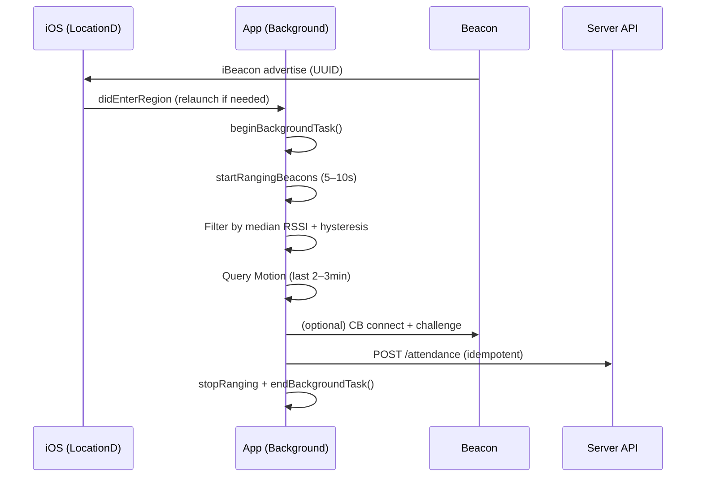
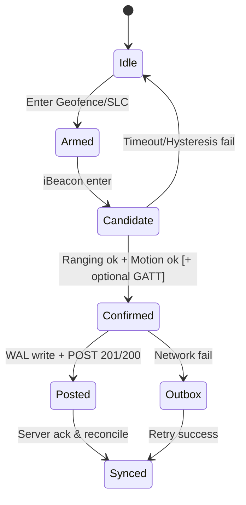

# iOS Auto‑Attendance via Beacon — **Production Playbook** (Senior)

> Mục tiêu: **Đi gần điểm chấm nào là tự phát hiện và chấm công**, an toàn dữ liệu, chịu lỗi tốt, pass App Review. Thiết kế ưu tiên **không mất dữ liệu** trong mọi tình huống (app đóng, màn hình tắt, máy khoá, offline, force‑quit, reboot…)

---

## 0) TL;DR — Chiến lược lai (hybrid) cấp sản xuất
- **Trigger chính:** `CoreLocation iBeacon Region Monitoring` (UUID công ty, wildcard major/minor) ⇒ iOS **relaunch** app khi *enter/exit* dù app đóng + màn hình tắt. Cửa sổ xử lý nền ~**vài giây** (thường ~10s).
- **Arming/giảm trễ:** `Geofence` (150–300m quanh cổng) + `notifyEntryStateOnDisplay` (khi bật màn hình xác định ngay state).
- **Hồi sinh sau terminate/reboot:** `Significant‑Change Location (SLC)` + `CLVisit` để **relaunch** định kỳ theo dịch chuyển lớn/điểm ghé.
- **Bộ lọc bối cảnh:** `Core Motion` (walking/running gần đây) + (tuỳ chọn) `HealthKit background delivery: steps`.
- **Chống giả mạo:** (tuỳ chọn) `CoreBluetooth` GATT **challenge‑response** ngắn sau khi đã ranging được beacon gần nhất.
- **Không mất dữ liệu:** Offline‑first, **Write‑Ahead Log** (WAL) + **Idempotency** + **At‑least‑once** gửi, **Exactly‑once** ghi nhận phía server (dedupe theo `idempotencyKey`).

---

## 1) Feasibility & Nguyên tắc hệ thống iOS
- iOS luôn theo dõi **region** (beacon + geofence) ở lớp hệ thống. Khi qua biên, iOS **đánh thức** app (relaunch nếu cần) và cấp **thời lượng nền hữu hạn**.
- **Giới hạn 20 regions/app** (geofence + beacon). Dùng **1 UUID công ty** + wildcard major/minor để không chạm trần; chỉ cấu hình vài geofence cố định/điểm ra vào.
- `CoreBluetooth` nền bị **giới hạn quét** (coalesce, yêu cầu Service UUID). Không đáng tin để “quét tự do” khi app đóng ⇒ chỉ dùng **GATT handshake** nhanh sau trigger chính.
- **Force‑quit (vuốt tắt):** thực tế không ổn định; dựa vào **SLC/Geofence** để hồi sinh cấu hình. Đào tạo user **không force‑quit**.

---

## 2) Kiến trúc tổng thể
```mermaid
flowchart LR
  subgraph HW[Beacon Layer]
    B1[iBeacon UUID company\nmajor=site\nminor=gate]
    B2[(TxPower, AdvInterval)]
  end

  subgraph iOS[App Layer]
    R1[RegionMonitor\n(iBeacon enter/exit)]
    G1[GeofenceManager\n(arm at campus radius)]
    S1[SLC/Visit Manager\n(relaunch & rotate configs)]
    RW[RangingWindow\n(5–10s)]
    MG[Motion Gating\n(CMMotionActivity, CMPedometer)]
    CB[CB Handshake\n(GATT challenge)]
    BG[BackgroundTaskGuard\n(begin/end)]
    AU[AttendanceUseCase\n(idempotent POST)]
    ST[Storage\n(WAL + Queue)]
    TL[Telemetry\n(Log + Metrics)]
  end

  subgraph SV[Server Layer]
    API[POST /attendance]\n(Idempotency, Dedupe, Audit)
    POL[Policy Engine]\n(Co-location, Rate limit, Device binding)
    OBS[Observability]\n(SLO, Traces, Alerts)
  end

  B1 -->|advertise| R1
  G1 --> R1
  S1 --> R1
  R1 --> BG --> RW --> MG --> CB --> AU
  AU --> ST
  AU --> API
  API --> POL
  API --> OBS
  TL -.-> OBS
```

### 2.1 Các “lớp” chức năng
- **Lớp Trigger:** iBeacon Region (chính) + Geofence (arming) + SLC/Visit (hồi sinh/định kỳ).
- **Lớp Quyết định:** RangingWindow + Motion/Step gating + (tuỳ chọn) CB handshake.
- **Lớp Bền vững dữ liệu:** WAL + Queue + Retry + Idempotency.
- **Lớp Quan sát:** Telemetry (log, metric, trace) + Health dashboard.

---

## 3) Luồng nghiệp vụ chủ đạo

### 3.1 Enter iBeacon khi máy khoá & màn hình tắt


### 3.2 Enter Geofence (arming) → giảm trễ
- Khi vào bán kính cơ sở: nạp cấu hình beacon gần, làm nóng cache (site→major mapping), đặt cờ `armed=true` → lần iBeacon tiếp theo xử lý nhanh hơn.

### 3.3 SLC/Visit → hồi sinh cấu hình
- Khi dịch chuyển lớn hoặc có “điểm ghé”, app được relaunch, đồng bộ danh sách site gần, kiểm tra quyền/cài đặt, xoay geofence phụ.

---

## 4) Module hoá (đề xuất thư mục)
```
App/
 ├─ Core/
 │   ├─ BackgroundTaskGuard.swift
 │   ├─ TelemetryLogger.swift
 │   ├─ Storage/
 │   │   ├─ WALStore.swift
 │   │   └─ OutboxQueue.swift
 │   └─ Network/
 │       ├─ HttpClient.swift
 │       ├─ Idempotency.swift
 │       └─ Reachability.swift
 ├─ Location/
 │   ├─ BeaconMonitor.swift
 │   ├─ GeofenceManager.swift
 │   ├─ SLCVisitManager.swift
 │   └─ RangingWindow.swift
 ├─ Sensors/
 │   ├─ MotionGating.swift
 │   └─ HealthKitGating.swift (optional)
 ├─ BLE/
 │   └─ CBHandshake.swift (optional)
 ├─ Domain/
 │   ├─ AttendanceUseCase.swift
 │   └─ Models.swift (AttendanceEvent, BeaconReading…)
 └─ Presentation/
     └─ (UI/Settings/Diagnostics)
```

---

## 5) Chính sách chống gian lận (Defense‑in‑Depth)
1) **Co‑location**: chỉ chấm công khi thỏa **(iBeacon enter) ∧ (geofence inside)**.
2) **Bối cảnh di chuyển**: yêu cầu `walking/running` trong 1 khoảng gần (ví dụ ≥30 bước trong 2 phút).
3) **GATT challenge (tuỳ chọn)**: handshake khoá chia sẻ ngắn với beacon để tránh replay/spoof iBeacon.
4) **Device binding**: mỗi user gắn với thiết bị (deviceId + keychain), kiểm soát đa thiết bị.
5) **Rate limiting & dwell**: tối thiểu X giây giữa 2 lần chấm; hysteresis chống ping‑pong giữa cửa.
6) **Server attestation**: kiểm `appVersion`, `deviceModel`, `jailbreak heuristic` (nhẹ), mạng nội bộ/VPN (nếu có chính sách).

---

## 6) Bền vững dữ liệu: **KHÔNG MẤT CHECK‑IN**

### 6.1 Write‑Ahead Log (WAL) & Outbox Queue
- Mỗi sự kiện (candidate/confirmed/posted) **ghi ngay** vào WAL (SQLite/GRDB/CoreData) trước khi gửi.
- OutboxQueue phụ trách **gửi lại** theo backoff (exponential + jitter). Tuân thủ **deadline** của BG task.
- Mọi request đều mang `IdempotencyKey = sha256(userId|deviceId|beaconId|tStart|nonce)`.

### 6.2 Chính sách gửi & hợp nhất
- **At‑least‑once** trên app → **Exactly‑once** trên server (dedupe theo `IdempotencyKey` trong TTL 24–72h).
- **Gộp** nhiều readings (RSSI timeline) vào 1 payload để giảm request trong cửa sổ nền.
- **Retry chiến lược**: `100ms, 500ms, 2s, 5s` (nếu còn thời gian nền); sau đó đẩy vào Outbox.

### 6.3 Phục hồi sau crash/reboot/force‑quit
- Tại `application(_:didFinishLaunching:)` và mọi trigger (region/geofence/slc): **drain Outbox** trước nếu có mạng.
- Nếu **không mạng**: tiếp tục WAL; hiển thị badge/cảnh báo nhẹ trong app cho người dùng (khi mở).

---

## 7) Thời lượng nền & tối ưu hoá
- Ngay khi nhận trigger: `beginBackgroundTask()` để xin thêm thời gian.
- **RangingWindow**: 5–10s, loop `CLLocationManager.rangedBeacons` mỗi ~1s, tính median RSSI + độ lệch chuẩn; kết thúc sớm khi đủ tin cậy.
- **Networking**: dùng **timeout ngắn** (2–4s), **idempotent**, nén JSON (gzip), tránh DNS chậm (preconnect hoặc IP pinning qua DoH nếu chính sách cho phép).
- Kết thúc bằng `endBackgroundTask()` chắc chắn (không rò).

---

## 8) Dữ liệu & API

### 8.1 Data model (app)
```json
{
  "id": "uuid-v4",                         // local event id
  "idempotencyKey": "hash",
  "userId": "u_...",
  "deviceId": "d_...",
  "timestamp": "2025-09-18T06:35:12Z",
  "type": "checkin|checkout",
  "siteId": "S_HQ",
  "beacon": {"uuid": "...", "major": 10, "minor": 3},
  "rssiSeries": [-75,-71,-68,-66],
  "txPower": -59,
  "motion": {"state": "walking", "steps2min": 42},
  "geofence": {"inside": true, "radius": 200},
  "handshake": {"ok": true, "rt": 180},
  "network": {"online": true, "latencyMs": 210},
  "app": {"version": "1.12.0", "build": 345},
  "device": {"model": "iPhone14,5", "os": "iOS 18.0"}
}
```

### 8.2 API (server)
- **POST** `/v1/attendance/events`
  - Headers: `Idempotency-Key`, `X-Device-Id`, `X-App-Version`.
  - Body: như trên (có thể rút gọn nếu băng thông hạn chế).
  - **201**: created (kèm `serverReceiptId`). **200**: duplicate (idempotent‑hit).
  - **409**: conflict policy (ví dụ: chấm quá gần lần trước) → server trả **action** và app log + hiển thị.
- **GET** `/v1/attendance/pending?since=...` (tuỳ chọn) để đồng bộ 2 chiều khi user mở app.

### 8.3 Dedupe & hợp nhất (server)
- Bảng `attendance_events` có unique index (`idempotency_key`).
- Hợp nhất **nhiều candidate gần nhau** trong 30–60s thành 1 phiên.
- Chính sách **enter/exit** theo dwell & hysteresis (ví dụ phải thấy *Near* ≥2 mẫu trong 3s).

---

## 9) Quyền, Capabilities & Cấu hình

### 9.1 Info.plist (mẫu)
```xml
<key>NSLocationWhenInUseUsageDescription</key>
<string>Ứng dụng cần vị trí để phát hiện điểm chấm khi bạn đến công ty.</string>
<key>NSLocationAlwaysAndWhenInUseUsageDescription</key>
<string>Cho phép “Always” để tự động chấm công ngay cả khi ứng dụng không mở.</string>
<key>NSBluetoothAlwaysUsageDescription</key>
<string>Dùng Bluetooth để phát hiện beacon gần bạn.</string>
<key>NSMotionUsageDescription</key>
<string>Dùng dữ liệu chuyển động để giảm nhầm lẫn và chống gian lận chấm công.</string>
<!-- Nếu dùng HealthKit steps -->
<key>NSHealthShareUsageDescription</key>
<string>Cho phép truy cập số bước chân để tăng độ chính xác khi bạn di chuyển vào công ty.</string>
```

### 9.2 Background Modes / Entitlements
- **Background Modes**: `Location updates`, *(tuỳ chọn)* `Uses Bluetooth LE accessories`.
- **HealthKit**: bật **Background Delivery** (nếu dùng) + quyền tương ứng.

### 9.3 App Settings & Feature Flags
- Remote Config: bật/tắt `gatt_challenge`, `use_healthkit`, `ranging_window_ms`, `geofence_radius`, `min_steps_window`…

---

## 10) Thông số Beacon (khuyến nghị)
- **Adv Interval**: 650–800 ms (cân bằng latency & pin). Cửa ra vào đông: 200–300 ms.
- **Tx Power**: phủ **bong bóng 3–5 m** tại điểm chấm; tránh chồng lấn giữa cổng gần nhau.
- **Bố trí**: cao 2–2.5 m, tránh kim loại/nguồn nhiễu; hành lang 15–30 m một beacon.
- **Quản trị**: inventory định danh (uuid/major/minor/serial), lịch thay pin, khoá vật lý, niêm phong.

---

## 11) Quan sát & SLO
- **Events**: `region_enter`, `region_exit`, `ranging_start/stop`, `motion_query`, `gatt_ok/fail`, `api_201/200/409`, `bg_timeout`, `offline_enqueue`, `outbox_sent`.
- **Metrics**: *Check‑in success rate*, *Median latency (trigger→201)*, *Outbox backlog*, *Avg ranging time*, *Battery impact*.
- **SLO**: 99% sự kiện được gửi lên server trong ≤ **5 phút** kể từ lúc trigger (bao gồm ca offline).
- **Dashboards**: theo site, theo phiên bản app, theo model thiết bị.

---

## 12) Rủi ro & Giảm thiểu
| Rủi ro | Ảnh hưởng | Biện pháp |
|---|---|---|
| Force‑quit / reboot | Không còn tiến trình | **SLC/Visit** để relaunch + sync lại cấu hình; đào tạo user. |
| Low Power Mode | Trễ deliver | Geofence arming + notifyEntryStateOnDisplay + chấp nhận latency vài giây. |
| Không mạng | Không gửi được | WAL + Outbox + retry khi có mạng; hiển thị trạng thái pending. |
| Beacon spoof | Gian lận | Co‑location, Motion gating, (tuỳ chọn) GATT challenge; kiểm tra lịch sử. |
| Ping‑pong vùng | Chấm sai | Hysteresis + dwell + rate limit. |
| Vượt 20 regions | Mất region | 1 UUID + ít geofence tĩnh; xoay vùng phụ theo SLC. |

---

## 13) Kịch bản kiểm thử (QA Matrix)
- Trạng thái máy: khoá + tắt màn / Low Power / vừa reboot / force‑quit.
- Mật độ beacon: đơn lẻ / chồng lấn / nhiều người cùng lúc.
- Di chuyển: đi bộ chậm / nhanh / đứng yên ngay cổng / đi lướt qua cổng.
- Mạng: online / offline / 2G‑3G / captive portal.
- Regression: idempotency, WAL recovery, outbox drain, bg timeout.

Tiêu chí pass: *tỉ lệ check‑in hợp lệ ≥ 99%*, *no‑loss* sau offline dài (72h), latency median < 5s với adv 650–800 ms.

---

## 14) Mẫu mã nguồn (rút gọn, định hướng)

### 14.1 BeaconMonitor (Region)
```swift
final class BeaconMonitor: NSObject, CLLocationManagerDelegate {
  private let lm = CLLocationManager()
  private let region: CLBeaconRegion
  private let onEnter: () -> Void

  init(uuid: UUID, onEnter: @escaping () -> Void) {
    self.region = CLBeaconRegion(uuid: uuid, identifier: "company.uuid")
    self.region.notifyEntryStateOnDisplay = true
    self.onEnter = onEnter
    super.init()
    lm.delegate = self
  }

  func start() {
    lm.requestAlwaysAuthorization()
    lm.startMonitoring(for: region)
    lm.requestState(for: region)
  }

  func locationManager(_ manager: CLLocationManager, didEnterRegion region: CLRegion) {
    guard region.identifier == self.region.identifier else { return }
    onEnter()
  }
}
```

### 14.2 RangingWindow
```swift
final class RangingWindow: NSObject, CLLocationManagerDelegate {
  private let lm = CLLocationManager()
  private var readings: [Int] = []
  private var timer: Timer?
  private let region: CLBeaconRegion
  private let onDone: (BeaconCandidate?) -> Void

  init(region: CLBeaconRegion, onDone: @escaping (BeaconCandidate?) -> Void) {
    self.region = region; self.onDone = onDone; super.init(); lm.delegate = self
  }

  func start(maxSeconds: TimeInterval = 8) {
    lm.startRangingBeacons(satisfying: CLBeaconIdentityConstraint(uuid: region.uuid))
    timer = Timer.scheduledTimer(withTimeInterval: maxSeconds, repeats: false) { [weak self] _ in self?.finish() }
  }

  func locationManager(_ manager: CLLocationManager, didRange beacons: [CLBeacon], satisfying constraint: CLBeaconIdentityConstraint) {
    guard let nearest = beacons.sorted(by: { $0.rssi > $1.rssi }).first, nearest.rssi != 0 else { return }
    readings.append(nearest.rssi)
    if readings.count >= 3, stdev(readings) < 6 && median(readings) > -70 { finish(candidate: .init(major: nearest.major.intValue, minor: nearest.minor.intValue)) }
  }

  private func finish(candidate: BeaconCandidate? = nil) {
    lm.stopRangingBeacons(satisfying: CLBeaconIdentityConstraint(uuid: region.uuid))
    timer?.invalidate(); onDone(candidate)
  }
}
```

### 14.3 AttendanceUseCase (idempotent)
```swift
struct AttendanceEvent: Codable { /* như mục 8.1 */ }

final class AttendanceUseCase {
  private let http: HttpClient; private let store: OutboxQueue
  init(http: HttpClient, store: OutboxQueue) { self.http = http; self.store = store }

  func post(_ ev: AttendanceEvent) {
    store.persist(ev) // WAL first
    http.post("/v1/attendance/events", body: ev, idempotencyKey: ev.idempotencyKey) { [weak self] result in
      switch result {
      case .success: self?.store.markSent(ev)
      case .failure: self?.store.scheduleRetry(ev)
      }
    }
  }
}
```

> Lưu ý: mã chỉ gợi ý cấu trúc; vào sản phẩm cần thêm kiểm lỗi, deadline BG task, reachability, gzip, circuit‑breaker…

---

## 15) App Store & Quyền riêng tư
- Mục đích thu thập rõ ràng: **chấm công tự động**.
- Không dùng dữ liệu vị trí/BT cho quảng cáo/track chéo.
- **Just‑in‑time prompts** giải thích tại sao cần “Always Location / Bluetooth / Motion / (HealthKit)”.
- Trang **Privacy Policy** nêu: loại dữ liệu, lưu trữ, thời hạn, quyền truy cập nội bộ, cơ chế xoá theo yêu cầu.

---

## 16) Vận hành & Triển khai
- **Feature flags** để bật/tắt từng lớp (Motion, HealthKit, GATT…).
- **Kill‑switch** từ server nếu có sự cố diện rộng.
- **MDM/IT**: tài liệu hướng dẫn bật Background App Refresh, Bluetooth, Location.
- **Canary rollout**: theo tỉ lệ % và theo site.

---

## 17) Checklist Go‑Live
- [ ] UUID iBeacon chuẩn hoá, danh mục major/minor → site/gate.
- [ ] Geofence chính xác (150–300m) + notifyEntryStateOnDisplay.
- [ ] SLC/Visit bật và test relaunch sau reboot.
- [ ] WAL + Outbox + IdempotencyKey hoạt động; test offline 72h.
- [ ] SLO/metrics dashboard hiển thị đúng.
- [ ] App Review: mô tả quyền + Privacy Policy đầy đủ.
- [ ] Runbook sự cố: mất beacon, mạng nội bộ down, server 409 tăng đột biến…

---

## 18) Phụ lục: State Machine (no‑loss)


---

**Kết luận:** Giải pháp **lai** xoay quanh *iBeacon Region* + *Geofence* + *SLC/Visit* với *Motion/HealthKit gating* và *(tuỳ chọn) GATT challenge* cho phép **tự động, tin cậy, và chống gian lận**, trong khi lớp **WAL + Idempotency** bảo đảm **không mất dữ liệu chấm công** ngay cả khi offline hoặc bị gián đoạn. Đây là cấu hình “production‑grade” đã tính đến rủi ro thực tế, chi phí pin, và yêu cầu App Store.

